# Chapter 2. PartyRock 개요 및 실습

## 실습준비

- 아래 사이트에 접속합니다.
    - [https://partyrock.aws/](https://partyrock.aws/)
- 사이트에서 Sign in 버튼을 클릭합니다.
    
    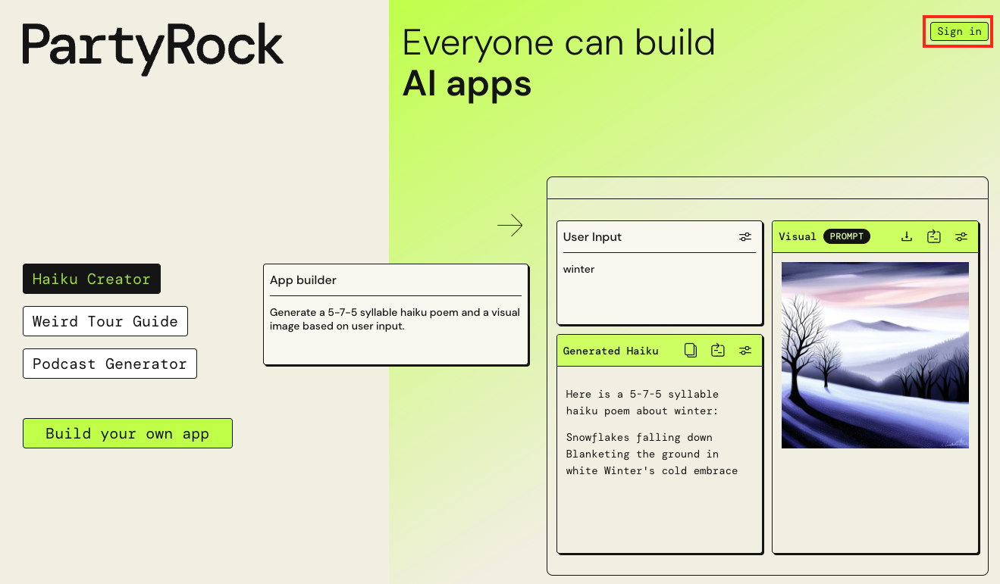
    
    - 참고. PartyRock 은 AWS 계정을 필요로 하지 않습니다.
- 목록에 있는 외부 IdP (Identity Provider) 에서 선택하여 로그인합니다. 여기서는 자신이 가진 google 계정을 사용하도록 하겠습니다.
    - 아래에서 Sing in with Google 버튼을 클릭합니다.
        
        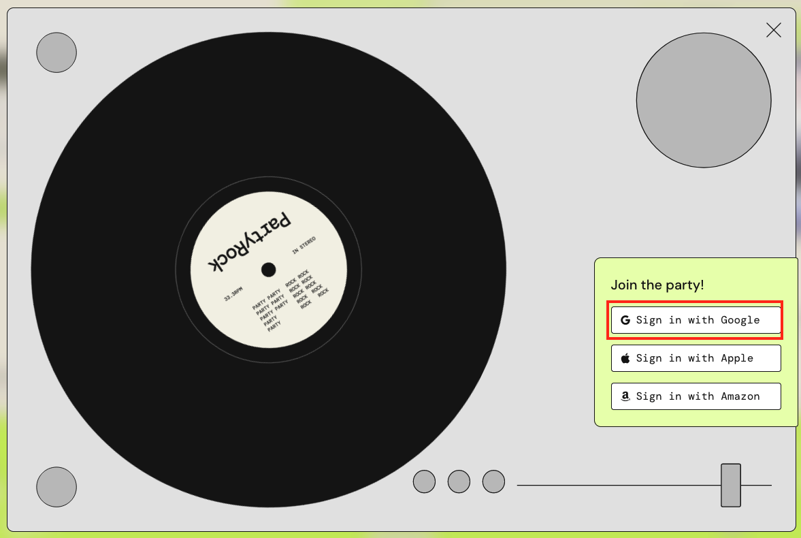
        
    - 이어지는 화면에서 Google 계정으로 로그인합니다.
    - 아래 화면에서 계속을 클릭하여 PartyRock 과 Google 계정을 연동합니다.
    
    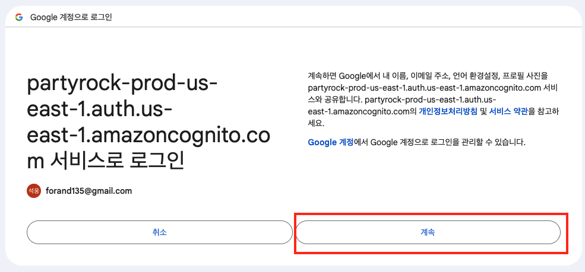
    
    - 아래 화면에서 username 을 적절하게 설정하고 submit 을 클릭합니다.
    
    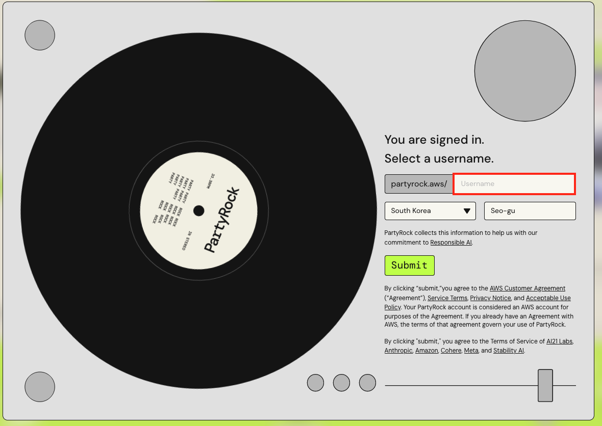
    

## 실습 1.  간단한 질문

- [https://partyrock.aws/u/js2222/zEj353AmT/Prompt-Engineering-Guide-Introduction](https://partyrock.aws/u/js2222/zEj353AmT/Prompt-Engineering-Guide-Introduction)
- Prompt Box 1 안에 아래 문구를 복사하여 붙여 넣고 실행( command + enter)해 봅니다.
    
    ```bash
    하늘은 왜 파란가요 ?
    ```
    
- 
    
    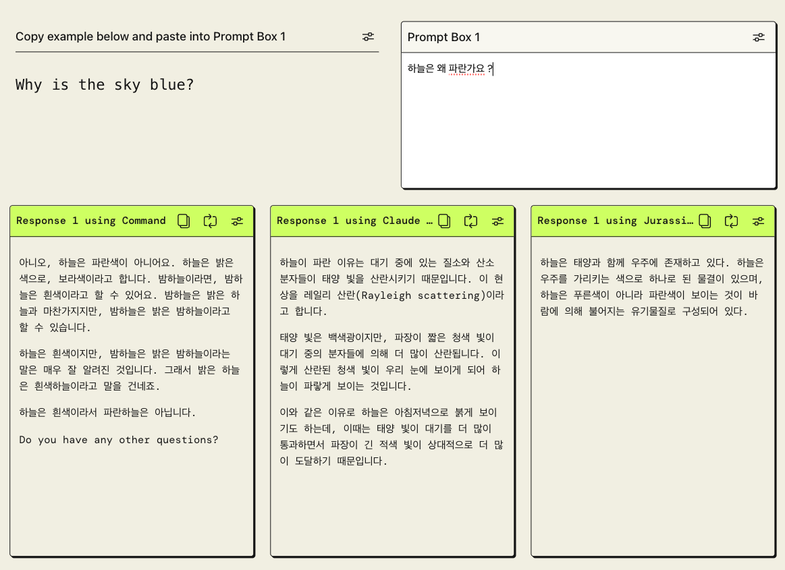
    
- 각각의 모델의 응답 결과를 확인합니다.
- 요약
    - PartyRock 에서는 여러 모델의 응답을 테스트해볼 수 있습니다.

## 실습 2. 컨텐츠 생성

- **이 실습은 생성형 AI 를 이용하여 브레인스토밍할 때 보다 상세한 내역과 그 제목을 생성하는 예제입니다.**
- 아래의 텍스트를 Prompt Box 1 에 입력하고 실행해 봅니다.
    
    ```python
    교육 산업을 위한 새로운 생성 AI 서비스에 대한 스타트업 아이디어 목록을 작성해 주세요. 
    각 스타트업 아이디어에 대해 스타트업이 무엇을 할 것인지에 대한 이름과 한 문장의 엘리베이터 피치를 제공하십시오
    ```
    
- 아래의 텍스트를 Prompt Box 1 에 입력하고 실행해 봅니다.
    
    ```
    log 함수와 관련된 문제를 쉬운문제 3가지와 어려운 문제 3가지를 출제해주세요.
    ```
    
- 아래의 텍스트를 Prompt Box 1 에 입력하고 실행해 봅니다.
    
    ```
    고등학교 수학능력 시험 수준의 삼각함수 관련 문제를 하나 출제해주세요.
    ```
    

## 실습 3. 컨텐츠 요약

- **대규모 언어 모델을 사용하여 대상 청중을 위한 콘텐츠를 다시 작성할 수도 있습니다.**
- 아래의 텍스트를 Prompt Box 1 에 입력하고 실행해 봅니다.

```
(1) 미래학교 전환 본격 추진

  교육부는 미래사회 변화에 대응하여 학교, 교육과정, 교원 등의 새로운 역할을 정립하고, 교육 시스템을 근본적으로 변화시키기 위한 구체적인 정책을 본격 추진한다. 

  먼저, 교육청과 함께 추진해 온 학교공간혁신의 결과를 토대로 그린스마트 미래학교의 모델을 도출·확산하기로 했다. 그린스마트 미래학교는 유연하고 다양한 공간, 스마트교실, 친환경·생태 교육환경, 지역과 공유하는 복합화시설 등을 갖추고, 학생 개개인을 위한 맞춤형 교육을 제공할 것으로 기대된다. 교육부는 올해 고교학점제, 미래형 교과서 등 교육정책과의 연계성, 전환의 시급성 등을 고려하여 그린스마트 미래학교 1차 대상 학교를 선정(761동, ’24년 완공 예정)하고, 2028년까지 2,835동을 전환할 계획이다.

  또한, 미래학교에서 가르치는 교육과정은 학생, 학부모, 교사, 국민과 함께 만들어 간다는 계획이다. 새로운 교육과정은 학생 개개인을 위한 맞춤형 교육, 학교의 자율성 강화, 온-오프라인 연계 수업 등 다양한 교수학습 혁신을 실현할 수 있는 방향으로 개정할 예정이다. 그 과정에서 학생들과 교사, 학부모 등이 참여하는 협의체를 구성(’21.9)하고, 주요 논의결과를 교육과정 개정에 반영한다.

  이와 함께, 고교학점제의 단계적 도입을 위한 기반도 조성해 나갈 예정이다. 고교학점제는 올해 마이스터고 2학년까지 적용을 확대하며, 2022년에는 전체 특성화고 도입 및 일반계고 대상 제도 부분 도입을 거쳐 2025년부터 전체 고등학교에서 본격적으로 시행한다. 교육부는 종합계획을 마련(’21.2.)하고 연구·선도학교를 확대·운영(’21. 일반계고 936교, 특성화고 전체 520교)하는 등 고교학점제의 단계적인 도입에 차질이 없도록 준비하겠다고 밝혔다. 2022 개정 교육과정, 고교학점제 등 새로운 교육제도를 반영한 미래형 수능 및 대입 방향(’28학년도 적용)을 수립하기 위한 논의도 착수한다.

  미래사회 변화에 대응하는 데 핵심 역량이 될 인공지능에 대한 이해와 환경생태 의식을 길러주기 위해 학교 교육을 강화하는 한편, 미래 변화에 맞는 교원양성체제 개편을 준비(’21.7. 발전방안 수립)하고, 새로운 교원수급모델도 만들어갈 계획이다.

(2) 공유·협력 기반의 고등교육 생태계 조성

  신산업 발전 및 지역혁신을 이끌어 갈 인재를 양성하기 위해 대학은 기존의 경쟁체제가 아닌 공유와 협력이라는 새로운 방식(패러다임)으로 변화하고 있다. 이에 교육부는 여러 대학이 교육자원, 교육과정 등을 공유하여 인공지능, 빅데이터, 차세대 반도체 등 디지털 신기술분야의 인재를 양성할 수 있도록 지원하는 디지털 혁신공유대학 사업을 신규 추진한다. 

  이와 함께, 다른 대학 간에도 첨단 분야 공동학과를 설치하고, 교원·기술·시설을 공유할 수 있도록 허용할 계획이다. ‘지자체-대학 협력 기반 지역혁신’ 사업을 통한 지역혁신 성과를 확산하고 현장에 안착할 수 있게 지원한다. 지자체와 대학이 협력하여 인재양성뿐 아니라 지역 내 취·창업 지원, 다양한 혁신 클러스터(혁신도시, 캠퍼스 혁신파크 등)와 연계한 정주여건 개선 등 종합적인 지원책을 마련하여 추진할 수 있도록 지원하고 있다. 지난해 선정된 3개 지역혁신 플랫폼(경남, 광주·전남, 충북)에 더하여 올해 1개 플랫폼을 추가로 선정하여 지원하고, 우수 성과사례를 전국으로 확산해나갈 예정이다. 

(3) 전 생애에 걸친 평생직업교육체제 구축

  국민의 생애 단계별 지속적인 성장을 위해 체계적인 평생학습 지원 시스템을 갖추고, 사회가 요구하는 다양한 직무 역량을 개발할 수 있도록 질 높은 직업교육을 제공할 계획이다.

  먼저, 국민이 원하는 평생교육·훈련 콘텐츠를 맞춤형으로 제공하고 학습·훈련 이력을 체계적으로 관리해주는 ‘범정부 온라인 평생학습 시스템’(가칭 ‘평생배움터’)을 단계적으로 구축한다. 또한, 사회 수요에 발맞추어 단기직무과정부터 고숙련 전문인재 양성까지 다양한 수준의 직무 중심 교육과정을 제공하는 ‘마이스터대’를 시범 운영(’21. 5교)할 예정이다. 

  더불어, 산업 수요에 대응한 특성화고의 자발적인 혁신을 지원(’21. 250교)하고, 중앙취업지원센터를 중심으로 양질의 고졸 일자리를 발굴하는 등 고졸 취업도 활성화한다.

**초등학교 3학년 학생이 이해할 수 있도록 위의 기사를 요약해주세요.** 
```

## 실습 4. 이미지 생성

- [https://partyrock.aws/u/js2222/zEj353AmT/Prompt-Engineering-Guide-Introduction](https://partyrock.aws/u/js2222/zEj353AmT/Prompt-Engineering-Guide-Introduction)
- 이미지 생성 모델을 사용하면 텍스트로부터 이미지를 생성할 수 있습니다.
- Stable Diffusion 모델과 Titan Image Generator 모델을 사용해 보겠습니다.
- 현재 배치된 widget 은 모두 text model 이므로 먼저 2개의 widget 을 삭제하겠습니다.
- 이 작업을 위해 아래 그림과 같이 상단의 Remix 클릭합니다.
    
    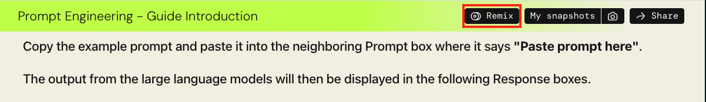
    
- “**Response 1 using Command” widget 을 삭제하기 위해 아래 그림의 도구 버튼을 클릭합니다.**
    
    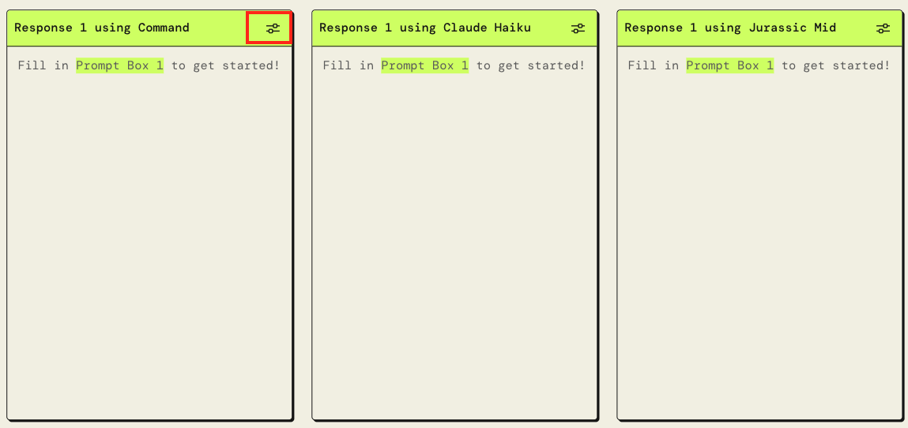
    
- 펼쳐진 창에서 Delete widget 버튼을 클릭합니다. > Confirm 버튼을 클릭합니다.
    
    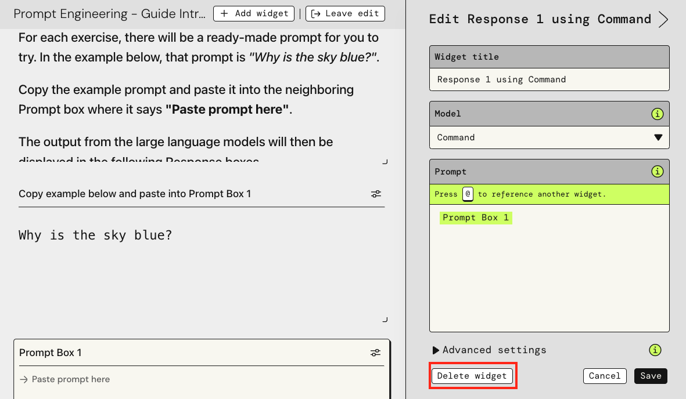
    
- 위와 같이 2번째 widget 도 삭제하면 아래와 같이 보일 것입니다.
    
    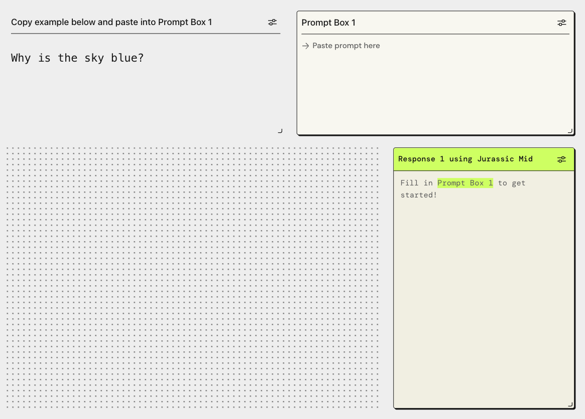
    
- 그리드 형태의 점들이 보이는 공간에서 Create widget 을 클릭합니다.
    
    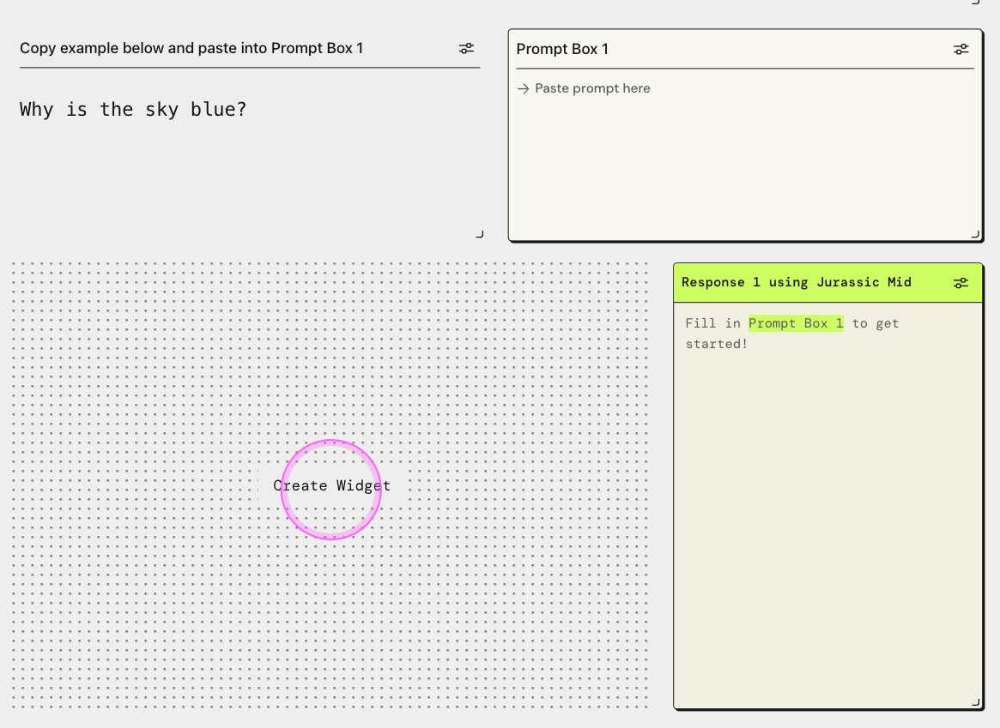
    
- 아래 그림처럼 Image Generation 을 클릭합니다.
    
    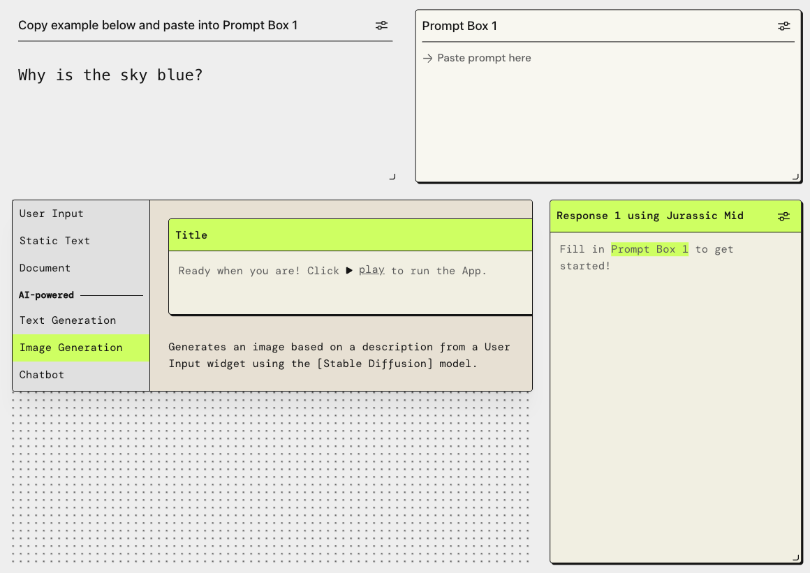
    
- 아래 그림과 같이 Widget title 은 “이미지 생성기1” 로 입력하고 Model 은 Titan Image Generator 로 선택하고 Save 합니다.
    
    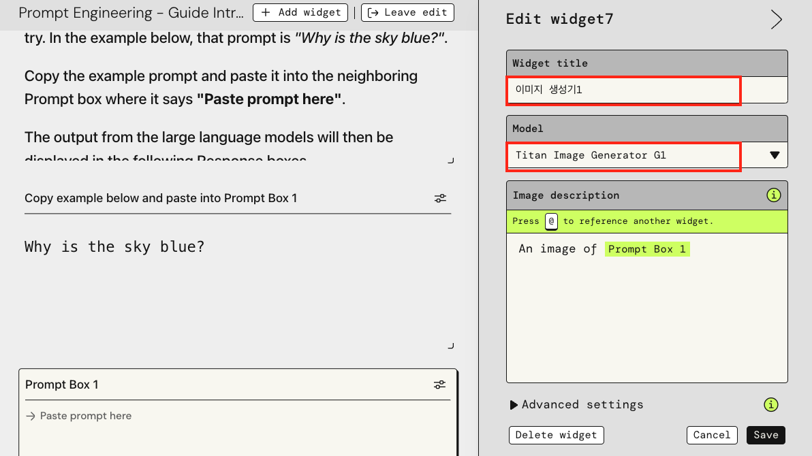
    
- “Response 1 using Jurrasic Mid” widget 을 삭제합니다.
- 그리드 형태의 점들이 보이는 공간에서 Create widget 을 클릭합니다.
    
    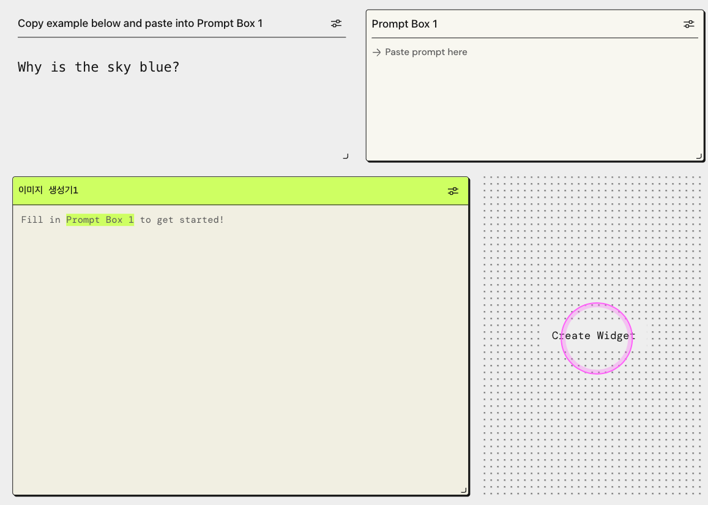
    
- Image Generation 을 클릭합니다.
- 아래 그림과 같이 Widget title 은 “이미지 생성기2” 로 입력하고 Model 은 Stable Diffusion 으로 선택하고 Save 합니다.
    
    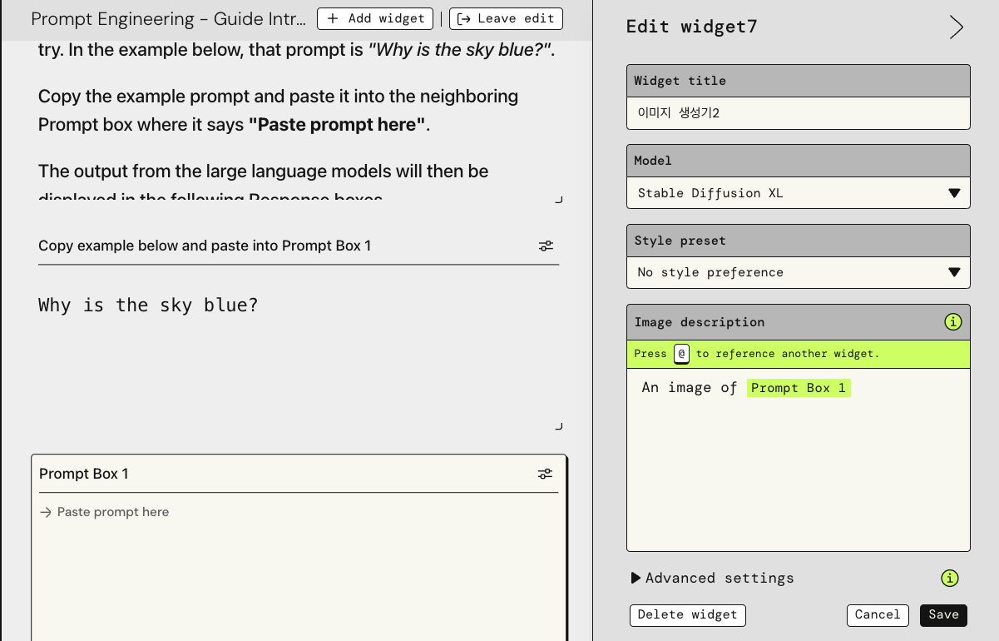
    
- Prompt Box 1에 “**Please draw a picture of a beautiful river in Van Gogh style.**” 로 입력하고 실행해 봅니다.
    
    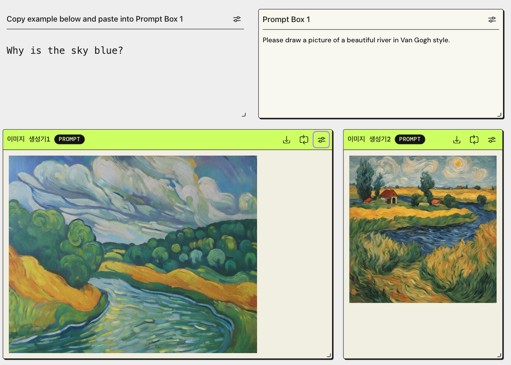
    
    - 그림을 다운로드 받을 수도 있습니다.
    - 그림에 포함되지 않기를 바라는 항목이 있다면 설정에서 negative prompt 에 항목을 추가할 수 있습니다.
    

## 참고. PartyRock  유의사항

- PartyRock 은 제한된 계정당 일정 credit 하에서 무상으로 사용이 가능합니다.
- 악의적 사용에 대한 탐지나 서비스 개선 목적으로 데이터를 수집합니다.
- 데이터 수집에 opt-out 하려면 Backstage 페이지에서 opt-out (악의적사용에 대한 데이터는 유지) 을 선택합니다.

## 참고. 프롬프트 엔지니어링 기법

- **단어 선택**: AI에서 원하는 어조, 스타일 및 콘텐츠를 호출하는 프롬프트에서 단어와 문구를 선택합니다. 보다 긍정적이고 건설적인 언어를 사용하면 더 나은 결과를 얻을 수 있습니다.
- **컨텍스트 제공**: AI에 관련 배경 정보와 예시를 제공하여 원하는 종류의 응답을 유도하는 데 도움을 줍니다.
- **논리적 구조화**: AI가 사용자가 요구하는 내용을 이해할 수 있도록 명확하고 논리적인 방식으로 프롬프트를 구성합니다. 이를 더 간단한 단계나 주요 항목으로 나누는 것이 도움이 될 수 있습니다.
- **범위 제한**: 광범위하고 모호한 요청보다는 좁고 잘 정의된 요청에 초점을 맞춰 프롬프트를 유지하세요. 이는 혼란을 줄이고 AI 대응을 향상시킵니다.
- **길이 관리**: 간결함과 충분한 세부정보 사이에서 적절한 균형을 찾으세요. 지나치게 긴 프롬프트는 따라가기 어려울 수 있지만 너무 짧은 프롬프트에는 필요한 컨텍스트가 부족할 수 있습니다.
- **표현 바꾸기**: 초기 프롬프트에서 원하는 결과가 나오지 않으면 다른 표현을 사용해 보세요. 작은 조정이 AI의 반응을 조정하는 데 큰 차이를 만들 수 있습니다.
- **피드백 제공**: AI의 응답이 제대로 진행되고 있는지 또는 벗어났는지 알 수 있습니다. 이는 AI를 더 나은 답변으로 안내합니다.