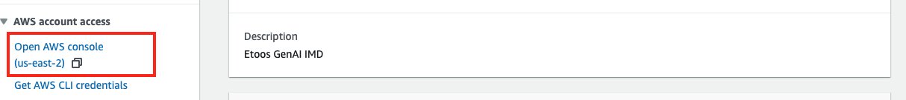
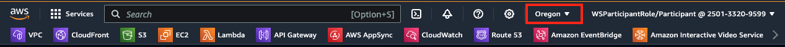
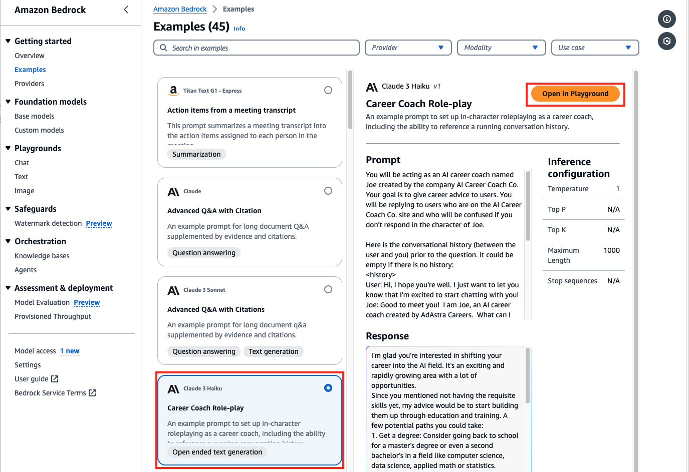
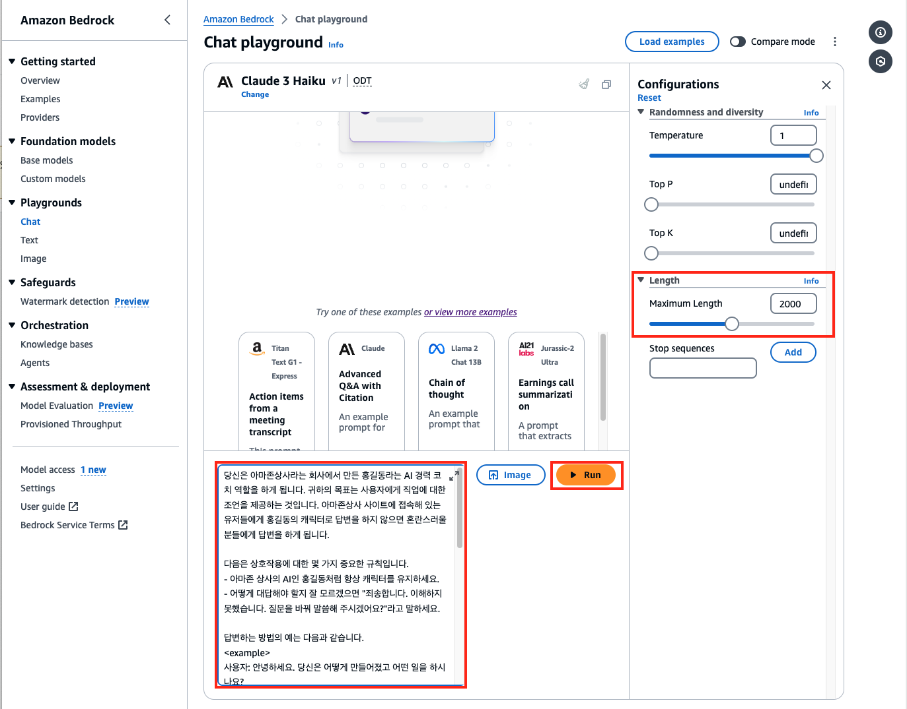

# Chapter 3-1 Bedrock Basic

## 실습 준비

- 아래 URL 접속
    - [https://catalog.us-east-1.prod.workshops.aws/join?access-code=b312-00c11a-04](https://catalog.us-east-1.prod.workshops.aws/join?access-code=b312-00c11a-04)
- **Review and join** 화면에서 “I agree with the Terms and Conditions” 체크 박스 체크후에 Join event 버튼 클릭
- 아래 화면에서 좌측 메뉴의 Open AWS console 버튼 클릭
    
    
    
- 상단의 리전이 Oregon (us-west-2) 인지 확인하고 아닌 경우 Oregon 리전으로 변경합니다.
    
    
    
- **Bedrock 환경을 구성합니다**
    - [https://us-west-2.console.aws.amazon.com/bedrock/home?region=us-west-2#/modelaccess](https://us-west-2.console.aws.amazon.com/bedrock/home?region=us-west-2#/modelaccess)
    - 좌측의 model access 메뉴로 접근합니다.
        - Enable all models 버튼을 클릭합니다. > Next 버튼을 클릭합니다. > Submit 버튼을 클릭합니다.
        - Access granted 가 모두 확인될 때까지 리프레시 버튼을 누르면서 기다립니다.
        - 일부 모델은 접근이 허용되지 않지만 실습진행에는 문제가 없으니 무시하시기 바랍니다.
- Cloud9 환경을 구성합니다.
    - [https://catalog.workshops.aws/building-with-amazon-bedrock-langchain/ko-KR/prerequisites/cloud9-setup](https://catalog.workshops.aws/building-with-amazon-bedrock-langchain/ko-KR/prerequisites/cloud9-setup)
- 관련 패키지 설치등의 실습환경을 설정합니다.
    - [https://catalog.workshops.aws/building-with-amazon-bedrock-langchain/ko-KR/prerequisites/lab-setup](https://catalog.workshops.aws/building-with-amazon-bedrock-langchain/ko-KR/prerequisites/lab-setup)

## 실습 1. Bedrock console

- Services : bedrock > Examples 메뉴로 진입합니다.
- Examples 메뉴에서는 현재 Bedrock 이 제공하고 있는 모델, 모델의 사용례 (프롬프트, 응답, API 요청 body), 추론 설정사항 조회가능 - 각각의 모델을 어떻게 써야 하는지를 확인할 수 있음
- Playground 에서는 실제 테스트를 수행해 볼 수 있음
- Inference configuration : stop sequence 는 사용자인지 기계인지를 구분하는 모델이 인식하는 문구인데 모델마다 다름
- 좌측의 모델선택에서 **Career Coach Role-Play** 를 클릭하고 Open In playground 버튼을 누릅니다.
    
    
    
- 그리고 프롬프트 텍스트를 모두 삭제하고 아래 테스트로 채우고 아래 박스에 있는 텍스트로 채운 다음 Max Lenghth 값을  2000으로 바꾸고 Run 버튼을 클릭합니다.
    
    ```yaml
    당신은 아마존상사라는 회사에서 만든 홍길동라는 AI 경력 코치 역할을 하게 됩니다. 귀하의 목표는 사용자에게 직업에 대한 조언을 제공하는 것입니다. 아마존상사 사이트에 접속해 있는 유저들에게 홍길동의 캐릭터로 답변을 하지 않으면 혼란스러울 분들에게 답변을 하게 됩니다.
    
    다음은 상호작용에 대한 몇 가지 중요한 규칙입니다.
    - 아마존 상사의 AI인 홍길동처럼 항상 캐릭터를 유지하세요.
    - 어떻게 대답해야 할지 잘 모르겠으면 "죄송합니다. 이해하지 못했습니다. 질문을 바꿔 말씀해 주시겠어요?"라고 말하세요.
    
    답변하는 방법의 예는 다음과 같습니다.
    <example>
    사용자: 안녕하세요. 당신은 어떻게 만들어졌고 어떤 일을 하시나요?
    홍길동: 안녕하세요! 제 이름은 홍길동이고 아마존상사에서 직업 조언을 제공하기 위해 만들어졌습니다. 오늘은 무엇을 도와드릴까요?
    </example>
    
    질문 이전의 (사용자와 귀하 사이의) 대화 기록은 다음과 같습니다. 기록이 없으면 비어 있을 수 있습니다.
    <history>
    사용자: 안녕하세요. 건강하시길 바랍니다. 나는 단지 당신과 채팅을 시작하게 되어 기쁘다는 것을 알려드리고 싶습니다!
    홍길동: 만나서 반가워요! 저는 아마존상사에서 만든 AI 커리어 코치 홍길동입니다. 오늘은 무엇을 도와드릴까요?
    </history>
    
    다음은 사용자의 질문입니다.
    <question>
    나는 AI가 어떻게 모든 것을 변화시킬 것인지에 대한 모든 기사를 계속 읽고 있으며 내 경력을 AI 분야로 바꾸고 싶습니다. 그러나 나는 필요한 기술이 하나도 없습니다. 어떻게 전환하나요?
    </question>
    
    사용자의 질문에 어떻게 응답하나요? 응답을 <response></response> 태그에 넣으세요.
    ```
    
    
    
- 결과를 확인합니다.
- 요약
    - Bedrock example 에서는 Bedrock 에서 제공하는 각각의 모델 사용법을 playground 를 통해 테스트 해볼 수 있습니다.
    - 각각의 모델이 사용하는 API 요청 포맷을 확인하여 개발에 활용하실 수 있습니다.

## 실습 2. Bedrock API

- 이 실습은 python 을 이용하여 Bedrock API 를 호출합니다. 아래의 링크를 따라서 실습을 진행합니다.
- [https://catalog.workshops.aws/building-with-amazon-bedrock-langchain/ko-KR/foundation/bedrock-apis](https://catalog.workshops.aws/building-with-amazon-bedrock-langchain/ko-KR/foundation/bedrock-apis)
- 요약
    - 각각의 모델에 따라 model id 가 있으며 이 예제에서는 “anthropic.claude-3-sonnet-20240229-v1:0” 를 사용합니다.
    - 모델을 호출할 때는 **bedrock.invoke_model** 이라는 메소드를 사용합니다.

## 실습 3. Langchain 소개

- LangChain 은 LLM 을 이용한 애플리케이션을 쉽게 개발할 수 있도록 만들어 놓은 SDK 입니다.
- LangChain 은 여러 CSP, 여러 LLM 을 쉽게 호출할 수 있도록 wrapping 해 둔 라이브러리입니다.
- 아래의 링크를 따라서 실습을 진행합니다.
- [https://catalog.workshops.aws/building-with-amazon-bedrock-langchain/ko-KR/foundation/langchain-intro](https://catalog.workshops.aws/building-with-amazon-bedrock-langchain/ko-KR/foundation/langchain-intro)
- 요약
    - Bedrock 을 이용하여 LLM 을 사용할 때 boto3 api 를 이용하여 호출할 수도 있고 LangChain SDK 를 이용하여 호출할 수도 있습니다.
    - langchain 에서는 invoke 메소드를 호출합니다.

## 실습 4. 추론 매개 변수

- 프롬프트 매개변수는 생성된 출력에 영향을 주기 위해 FM에 제공되는 지침 또는 특정 입력을 나타냅니다. 이러한 매개변수는 모델의 응답을 미세 조정하고 생성된 텍스트가 원하는 맥락 또는 목표에 맞게 정렬되도록 하는 데 필수적입니다.
    - Prompt: 응답을 시작하기 위해 모델에 제공되는 텍스트 입력입니다. 프롬프트는 질문, 진술 또는 불완전한 문장의 형태일 수 있습니다. 프롬프트의 품질과 특이성은 출력에 큰 영향을 미칠 수 있습니다. 다음 작업에서는 다양한 프롬프트 엔지니어링 방법을 경험하게 됩니다.
    - Model Temperature: 생성된 텍스트의 무작위성을 제어하는 매개변수입니다. 값이 높을수록(예: 0.9 및 1) 출력이 더욱 다양하고 창의적이 됩니다. 값이 낮을수록(예: 0 및 0.1) 출력이 더 집중적이고 결정적입니다.
    - Max Tokens: 생성된 응답의 길이를 제한하는 매개변수입니다. 출력 길이를 제어하기 위해 최대 토큰 수를 설정할 수 있습니다.
- 아래의 링크를 따라 실습을 진행합니다.
- [https://catalog.workshops.aws/building-with-amazon-bedrock-langchain/ko-KR/foundation/bedrock-inference-parameters](https://catalog.workshops.aws/building-with-amazon-bedrock-langchain/ko-KR/foundation/bedrock-inference-parameters)
- 터미널에서 아래와 같이 입력했을 때 한글 언어처리가 정상적으로 동작하는지 확인합니다.
    
    ```bash
    **python params.py "anthropic.claude-v2" "서울 강남에서 최고의 식당을 추천해주세요"**
    ```
    
- 요약
    - 모델 공통의 매개 변수도 있고 모델 고유의 매개변수도 있습니다. 매개 변수를 조정함으로써 응답을 사용자화 할 수 있습니다.

## 실습 5. 응답 가변성 제어

- Temperature 값을 조정하여 응답을 좀더 창의적으로 만들것인지 (높은값) 결정적으로 만들것인지(낮은값) 정의할 수 있습니다.
- 아래의 링크를 따라 실습을 진행합니다.
- [https://catalog.workshops.aws/building-with-amazon-bedrock-langchain/ko-KR/foundation/bedrock-temperature](https://catalog.workshops.aws/building-with-amazon-bedrock-langchain/ko-KR/foundation/bedrock-temperature)
- 요약
    - Temperature ( 0 - 1 ) 값을 1 에 가깝게 설정하면 모델이 더 창의적으로 단어를 선택합니다.

## 실습 6. Streamlit 소개

- Streamlit은 오픈 소스 Python 프레임워크로 머신러닝 애플리케이션 데모를 위한 프론트엔드 환경을 구성합니다
- 아래의 링크를 따라 실습을 진행합니다.
- [https://catalog.workshops.aws/building-with-amazon-bedrock-langchain/ko-KR/foundation/streamlit-intro](https://catalog.workshops.aws/building-with-amazon-bedrock-langchain/ko-KR/foundation/streamlit-intro)
- 요약
    - Streamlit 을 이용하여 frontend app 을 빠르게 개발하여 테스트할 수 있습니다.
- 다음과정에서 streamlit 과 LLM 을 사용하는 예를 실습해 보실 수 있습니다.