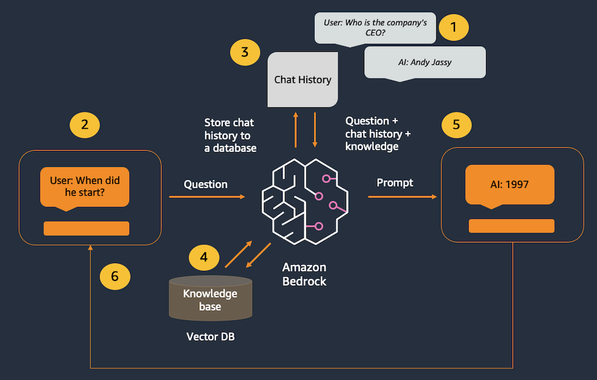
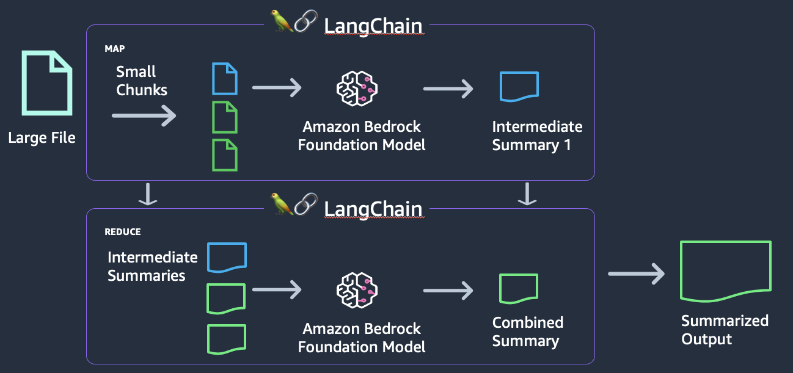
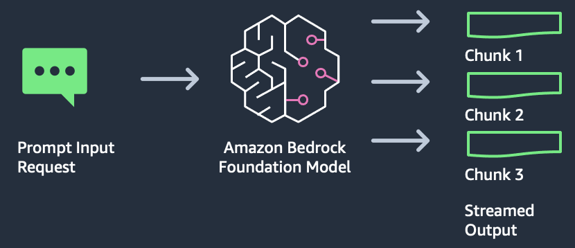

# Chapter 3-2 Bedrock Text Advanced

## 실습 1. RAG 를 이용한 챗봇

- **문서와 같은 지식베이스를 활용하여 텍스트를 생성하게 할 수 있습니다.**
- 앞서 본 것과 같이 채팅의 히스토리를 추적하고 맥락에 추가하기 위해 LangChain 의 ConversationBufferWindowMemory 를 사용합니다.
- Anthropic Claude, Amazon Titan Embeddings, LangChain, Streamlit 을 이용해 애플리케이션을 개발합니다.
- Architecture
    
    
    
    - 지난 상호작용이 채팅 메모리 객체에서 추적됩니다.
    - 사용자가 새 질문을 입력합니다.
    - 채팅 기록이 메모리 객체에서 검색되어 새 메시지 앞에 추가됩니다.
    - 타이탄 임베딩을 사용하여 질문을 벡터로 변환한 다음 벡터 데이터베이스에서 가장 가까운 벡터와 매치합니다.
    - 결합된 기록, 지식 및 새 메시지가 모델로 전송됩니다.
    - 모델의 응답이 사용자에게 표시됩니다.
- [https://catalog.workshops.aws/building-with-amazon-bedrock-langchain/ko-KR/intermediate/bedrock-rag-chatbot](https://catalog.workshops.aws/building-with-amazon-bedrock-langchain/ko-KR/intermediate/bedrock-rag-chatbot) 를 따라 실습을 진행합니다.
- 요약
    - RAG 를 이용하여 기존의 고객의 문서등을 지식 소스로 활용하여 채팅앱을 만들 수 있습니다.

## 실습 2: 문서 요약

- Amazon Bedrock, LangChain, Streamlit 을 이용하여 문서요약앱을 개발할 수 있습니다.
- 이 실습에서는 2022 년도 아마존 주주서한의 문서를 요약합니다.
- Use case
    - 긴 문서 요약
    - 통화 기록 요약
    - 고객 활동 기록 요약
- Architecture
    
    
    
    - 큰 문서를 작은 청크들로 나눕니다.
    - 이 작은 청크를 기반으로 중간 요약을 생성합니다.
    - 중간 요약들을 통합 요약으로 요약합니다.
- [https://catalog.workshops.aws/building-with-amazon-bedrock-langchain/ko-KR/intermediate/bedrock-summarization](https://catalog.workshops.aws/building-with-amazon-bedrock-langchain/ko-KR/intermediate/bedrock-summarization) 를 따라 실습을 진행합니다.
- 요약
    - 로컬 파일을 로드하여 요약을 생성할 수 있습니다.
    - 원본 문서는 영문으로 되어 있지만 프롬프트를 한글로 지정하여 Claude3 model 에서 한글로 요약을 생성할 수 있습니다.

## 실습 3: 응답 스트리밍

- 스트리밍 형태로 응답을 생성하는 애플리케이션을 개발할 수 있습니다.
- Architecture
    
    
    
- [https://catalog.workshops.aws/building-with-amazon-bedrock-langchain/ko-KR/intermediate/bedrock-streaming](https://catalog.workshops.aws/building-with-amazon-bedrock-langchain/ko-KR/intermediate/bedrock-streaming) 를 따라 실습을 진행합니다.

##