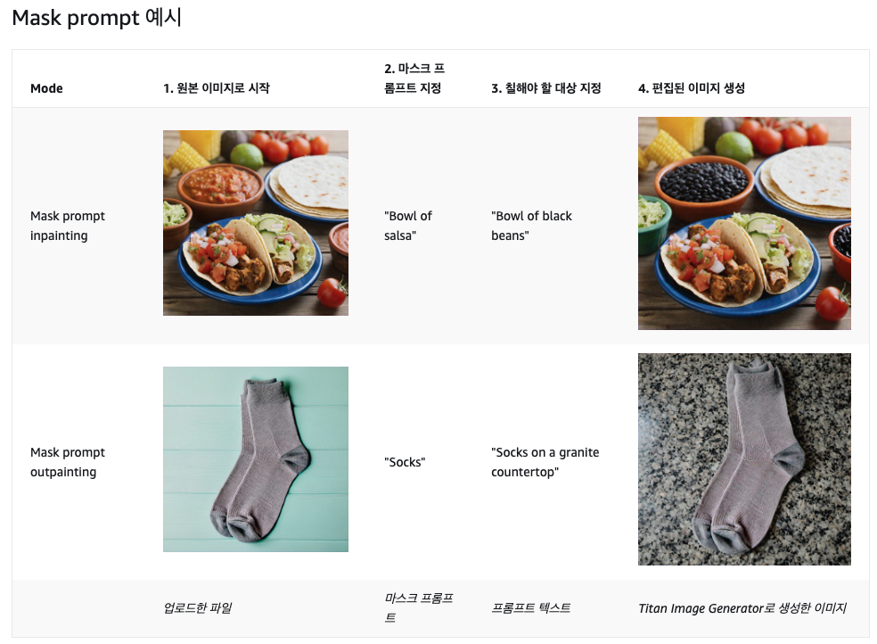

# Chapter 3-3 Bedrock Image

## 실습 1: 이미지 검색

- Titan Multimodal Embeddings, LangChain, Streamlit으로 간단한 이미지 검색 애플리케이션을 만듭니다.
- [Titan Multimodal Embeddings](https://docs.aws.amazon.com/bedrock/latest/userguide/titan-multiemb-models.html) 는 텍스트, 이미지 또는 텍스트와 이미지의 조합으로 이미지를 검색하는 등의 사용 사례를 위한 멀티모달 임베딩 모델입니다.
- Use case
    - 이미지 컬렉션 검색
    - 컬렉션에서 유사 / 동일한 이미지 찾기
    - 기존 예시와의 유사성을 기준으로 이미지 분류하기
- 이번 실습에서는 인덱스를 생성할 이미지가 이미 cloud9 안에 포함되어 있습니다.
- [https://catalog.workshops.aws/building-with-amazon-bedrock-langchain/ko-KR/image-labs/bedrock-image-search](https://catalog.workshops.aws/building-with-amazon-bedrock-langchain/ko-KR/image-labs/bedrock-image-search) 을 따라 실습을 진행합니다.

## 실습 2: 프롬프팅을 통한 이미지 생성

- Amazon Titan Image Generator, Amazon Bedrock, Streamlit을 사용하여 기본 이미지 생성기를 구축합니다.
- Titan Image Generator는 텍스트 프롬프트에서 이미지를 생성합니다.
- 이미지 생성 모델은 negative prompting 을 별도로 지원하는 경우가 많습니다. negative prompting 은 이미지에 나타나서는 안되는 문구를 입력합니다.
- [https://catalog.workshops.aws/building-with-amazon-bedrock-langchain/ko-KR/image-labs/bedrock-image-prompts](https://catalog.workshops.aws/building-with-amazon-bedrock-langchain/ko-KR/image-labs/bedrock-image-prompts) 을 따라 실습을 진행합니다.
- 요약
    - 유해하다고 판단되는 이미지는 Bedrock 에 의해 자동적으로 필터링됩니다. (선정적, 폭력적, 차별적 언어)

## 실습 3: 이미지 변형

- Amazon Titan Image Generator, Amazon Bedrock 및 Streamlit을 사용하여 이미지 변형 애플리케이션을 구축합니다.
- Use case
    - 마케팅 콘텐츠, 스톡 사진 사용 사례 및 컨셉 아트를 위한 이미지의 대체 버전 만들기.
- [https://catalog.workshops.aws/building-with-amazon-bedrock-langchain/ko-KR/image-labs/bedrock-image-variation](https://catalog.workshops.aws/building-with-amazon-bedrock-langchain/ko-KR/image-labs/bedrock-image-variation) 를 따라 실습을 진행합니다.

## 실습 4: 마스킹 소개

- Amazon Titan 이미지 생성기, Amazon Bedrock 및 Streamlit을 사용하여 이미지 마스킹 애플리케이션을 구축합니다
- Amazon Titan Image Generator를 사용하여 이미지를 편집할 때 이해해야 할 두 가지 핵심 개념
    - **Masking Mode: 이미지의 일부를 교체하거나 보존할 부분을 표시하는 작업**
        - **Image mask** 를 사용하는 경우
            - 검은색 부분 : 마스킹할 영역
            - 흰색 부분 : 마스킹하지 않을 영역
            - 조건
                - 원본과 동일한 크기 및 해상도
                - PNG 파일
                - RGB / Grey 스케일
                - 알패채널 없음 (알파채널은 이미지의 편집과 합성시에 사용하는 채널)
        - **mask prompt** 를 사용하는 경우
            - 프롬프트를 사용하여 동적으로 마스킹하는 방법
    - **Painting : 새로운 이미지를 생성하는 작업**
        - inpainting : 마스킹 영역의 모든 픽셀을 다시 칠하기, 이미지 마스크를 사용하면 검은색 픽셀이 모두 다시 칠해짐
        - outpainting : 마스킹 영역외의 모든 픽셀을 다시 칠하기, 이미지 마스크를 사용하면 희색 픽셀이 모두 다시 칠해짐
    - 예제
        
        
        
        
        
- Use case
    - 이미지에 항목 추가하기
    - 이미지에서 원하지 않는 항목 제거하기
    - 이미지의 배경 변경하기
    - 이미지 확장하기
- 요약
    - image 변형에 있어서 **영역을 지정할 때 1) image masking  과 2) mask prompt 중에서 선택**적으로 사용할 수 있습니다.
    - **inpainting 은 영역안을 다시 그리고 outpainting 은 영역 바깥을 새로 그립니다**.

## 실습 5: 객체를 변경 또는 제거 (이미지 변형의 응용)

- Amazon Titan Image Generator, Amazon Bedrock 및 Streamlit을 사용하여 이미지 객체 변경 애플리케이션을 구축합니다.
- Use case
    - 차량 사진에서 사람 제거하기
    - 집 사진에서 잡동사니 제거하기
    - 가구나 장식품을 비슷한 크기의 아이템으로 교체하기
- Sample
    
    
    
- [https://catalog.workshops.aws/building-with-amazon-bedrock-langchain/ko-KR/image-labs/bedrock-image-replacement](https://catalog.workshops.aws/building-with-amazon-bedrock-langchain/ko-KR/image-labs/bedrock-image-replacement) 링크의 실습을 따라합니다.

## 실습 6: 배경 교체 (outpainting 이용)

- Amazon Titan Image Generator, Amazon Bedrock 및 Streamlit을 사용하여 이미지 배경 교체 애플리케이션을 구축합니다
- Sample
    
    
    
- Outpainting 의 두가지 Mode
    - **Default** (기본) : 마스킹 이미지가 확장되거나 변형됨
    - **Precise** (정밀) : 마스킹 이미지가 확장되거나 변형되지 않음
    
    
    
- Use case
    - 제품 사진에 대체 배경 만들기
    - 제품 사진의 배경에서 산만하고 어수선한 요소 제거하기
    - 다른 이미지의 사람이나 사물을 사용하여 새로운 마케팅 또는 기사 이미지 만들기
- [https://catalog.workshops.aws/building-with-amazon-bedrock-langchain/ko-KR/image-labs/bedrock-image-background#outpainting-mode:-default-()-vs.-precise-()](https://catalog.workshops.aws/building-with-amazon-bedrock-langchain/ko-KR/image-labs/bedrock-image-background#outpainting-mode:-default-()-vs.-precise-()) 의 링크를 따라 실습을 진행합니다.
- 아래와 같은 에러가 발생하는 경우
    
    
    
- 아래로 바꾸어 실행해보시기 바랍니다.
    - object to keep = House
    - Description including the object to keep and background to add: = House at a beach

## 실습 7: 이미지 인페인팅

- Amazon Titan Image Generator, Amazon Bedrock 및 Streamlit을 사용하여 이미지 인페인팅 애플리케이션을 구축합니다.
- Sample
    
    
    
    - 위 작업을 위해서는 원본 이미지 외에 마스킹에 사용할 이미지가 필요합니다.
    - 항상 검은색 영역이 마스킹 영역이며 인페인팅 (검은색 영역), 아웃페인팅 (검은색 영역외의 영역 = 흰색 영역) 에 따라 다시 칠해지는 영역이 달라집니다.
- Use case
    - 방 사진의 특정 영역을 바꿔가며 데코 아이디어를 구상하기.
    - 이미지의 일부가 너무 훤히 드러나 있거나 제거해야 할 방해물이 있는 부분을 변경할 수 있습니다.
    - 사용자가 이미지에서 다시 칠해야 할 부분을 선택할 수 있도록 합니다.
- [https://catalog.workshops.aws/building-with-amazon-bedrock-langchain/ko-KR/image-labs/bedrock-image-insertion](https://catalog.workshops.aws/building-with-amazon-bedrock-langchain/ko-KR/image-labs/bedrock-image-insertion) 의 실습을 진행하시기 바랍니다.

## 실습 8: 이미지 이해

- Amazon Bedrock Anthropic Claude 3 및 Streamlit을 사용하여 이미지 이해 애플리케이션을 구축
- Use case
    - 접근 가능한 대체 텍스트 및 이미지 캡션 생성
    - 이미지 처리 파이프라인에서 이미지가 부적절하거나 관련 콘텐츠와 일치하지 않는지 감지하는 데 사용
    - 이미지 처리 파이프라인에서 마스크 프롬프트 및 인페인팅/아웃페인팅 작업을 자동화하는 데 사용
    - 이미지 분류
    - 이미지에서 텍스트 추출
- 이 작업을 위해서는 이해를 필요로 하는 이미지와 요청하는 프롬프트가 필요합니다.
- 샘플 Prompt 는 아래와 같습니다
    - Image caption (이미지 간단 묘사) : Please provide a brief caption for this image.
    - Detailed description (이미지 상세 묘사) : Please provide a thoroughly detailed description of this image.
    - Image classification (이미지 분류) :Please categorize this image into one of the following categories: People, Food, Other. Only return the category name.
    - Object recognition (객체 탐지) : Please create a comma-separated list of the items found in this image. Only return the list of items.
    - Subject identification (주요 객체 식별) : Please name the primary object in the image. Only return the name of the object in <object> tags.
    - Writing a story (이야기 생성) : Please write a fictional short story based on this image.
    - Answering questions (질문에 대한 답변) : What emotion are the people in this image displaying?
    - Transcribing text (텍스트 추출) : Please transcribe any text found in this image.
    - Translating text (텍스트 번역) : Please translate the text in this image to French.
- [https://catalog.workshops.aws/building-with-amazon-bedrock-langchain/ko-KR/image-labs/bedrock-image-understanding](https://catalog.workshops.aws/building-with-amazon-bedrock-langchain/ko-KR/image-labs/bedrock-image-understanding) 링크를 따라 실습을 진행하시기 바랍니다.
- **위에서는 모든 프롬프트가 사전에 설정되어 있는 프롬프트를 사용하는데 Anthropic Claude 3 모델은 한글을 인식하기 때문에 여러분의 프롬프트로 바꾸어 시도해보시기 바랍니다.**
    - “이 이미지를 바탕으로 허구의 단편 소설을 써주세요. “

## 실습 9: 멀티모달 챗봇

- 멀티모달 챗봇은 다양한 입력 포맷 (이미지, 텍스트 등) 을 이해할 수 있는 챗봇입니다.
- Use case
    - 이미지 분석을 통한 간단한 대화형 사용자 대화
    - 이미지 비교
- [https://catalog.workshops.aws/building-with-amazon-bedrock-langchain/ko-KR/image-labs/bedrock-multimodal-chatbot](https://catalog.workshops.aws/building-with-amazon-bedrock-langchain/ko-KR/image-labs/bedrock-multimodal-chatbot) 링크를 따라 실습을 진행합니다.