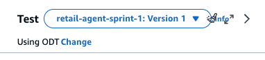
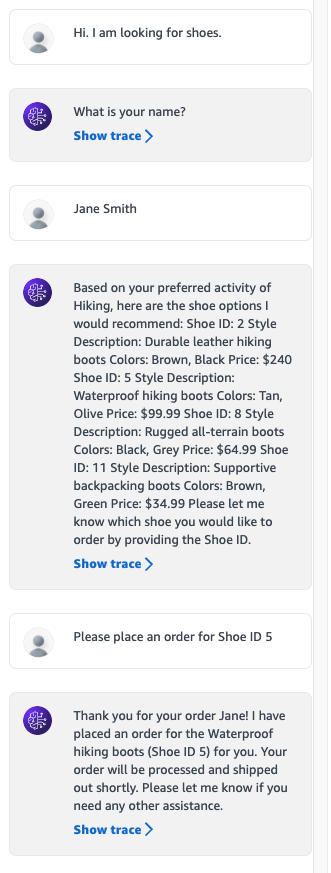

# Chapter 3-4 Bedrock KB & Agents

## 실습1. Knowledge Bases for Amazon Bedrock - End to end example

Bedrock 의 Knowledge Base 를 활용하여 RAG 를 구현하는 예제입니다.

### 전체 구현 절차

- Knowledge Base 의 data source 로 사용할 s3 버킷 생성
- Knowledge Base 에서 사용할 자신의 문서 업로드
- Data source sync
- Prompting

### Knowledge base 의 data source 로써 사용할 s3 bucket 을 생성합니다.

- [https://us-west-2.console.aws.amazon.com/s3/home?region=us-west-2#](https://us-west-2.console.aws.amazon.com/s3/home?region=us-west-2#)
- create bucket 버튼 클릭
- bucket name = bedrock-workshop-kb-<youralias>
    
    
    
- create bucket 버튼 클릭

### S3 에 데이터 저장

- 아래 4개의 파일을 local pc 에 다운로드 받습니다. (샘플로 사용할 문서는 KERIS 가 발행한 교육현장의 에듀테크 활용현황분석 파일입니다.)
    - 파일 생략    
- 위에서 생성한 s3 버킷에 파일을 업로드합니다.
    - [https://us-west-2.console.aws.amazon.com/s3/home?region=us-west-2#](https://us-west-2.console.aws.amazon.com/s3/home?region=us-west-2#)
    - 조금전 생성한 s3 버킷을 클릭합니다.
    - upload 버튼을 클릭하고 위에서 받은 파일을 업로드합니다.

### Knowledge base 생성

- [https://us-west-2.console.aws.amazon.com/bedrock/home?region=us-west-2](https://us-west-2.console.aws.amazon.com/bedrock/home?region=us-west-2)
- 좌측메뉴의 Orchestration > Knowledge bases 를 클릭합니다.
- Create knowledge base 버튼을 클릭합니다.
    
    
    
- 모든 설정을 default 로 두고 next 를 클릭합니다.
    
    
    
- Browse s3 버튼을 눌러 위에서 생성한 버킷을 선택하고 Next 버튼을 클릭합니다.
    
    
    
    
    
- 모델은 Titan Embedding G1 - Text 를 선택하고 나머지 옵션은 그대로 두고 Next 를 클릭합니다. > Create Knowledge base 버튼을 클릭합니다.
    - 
    
    
    
- 생성된 Knowledge base 의 Data source 에서 해당 소스를 선택하고 Sync 버튼을 누릅니다.
    
    
    
- sync 가 완료되면 상단의 test button 을 눌러 테스트할 준비를 합니다.
    
    
    
- Select model 버튼을 눌러 **Claude Sonnet** 모델을 선택하고 Apply 합니다.
- 프롬프트에 아래와 같이 입력하고 생성된 응답을 확인합니다.
    
    ```bash
    에듀테크를 사용하지 않는 이유는 무엇입니까 ?
    ```
    
- 참조된 문서를 확인할 수 있습니다.
    
    
    
- 프로그래밍 방식으로 구현하는 예제는 아래를 참고하시기 바랍니다.
    - [https://github.com/fromcloud/amazon-bedrock-samples/tree/main/knowledge-bases](https://github.com/fromcloud/amazon-bedrock-samples/tree/main/knowledge-bases)

## 실습2. Agents for Bedrock

참고 : ‣ 

### 개요

- Agents for Bedrock 은 **ReAct** 와 **Chain of thought** 를 보다 쉽게 구현할 수 있도록 도움을 주는 완전관리형 서비스입니다.
- ReAct는 사용자가 요청한 작업을 해결하는 방법을 결정하기 위해 FM에 추론추적과 작업별 행동을 결합한 패러다임입니다.  ReAct 프레임워크를 사용하면 LLM이 외부 도구와 상호 작용하여 보다 신뢰할 수 있고 사실적인 응답을 반환할 수 있는 추가 정보를 검색할 수 있습니다.
- **Components in agents for Amazon Bedrock**
    - Amazon Bedrock agent 는 사용자가 요청한 작업의 프롬프트 엔지니어링 및 조정을 자동화합니다.
    - 고객의 정보로 프롬프트를 안전하게 강화하여 자연어로 사용자에게 응답을 제공할 수 있습니다.
    - 에이전트는 사용자가 요청한 작업을 여러 단계로 나누고 FM의 도움을 받아 하위 작업을 조정합니다.
    - 작업 그룹은 에이전트가 자율적으로 수행할 수 있는 작업입니다.
    - 작업 그룹은 AWS Lambda 함수 및 관련 API 스키마에 매핑되어 API 호출을 수행합니다.
- **Solution overview**
    - 고객 서비스 봇을 구축하기 위해 신발 소매업체 사용 사례를 사용합니다. 봇은 인간과 같은 대화를 통해 옵션을 제공함으로써 고객이 신발을 구매할 수 있도록 돕습니다. 고객은 하위 작업을 수행하기 위해 외부 API를 호출하는 여러 단계를 통해 자연어로 봇과 대화합니다. 다음 다이어그램은 샘플 프로세스 흐름을 보여줍니다.
    
    
    
    - 전체 과정 : Agent 는 API 명세서 (S3 에 json 포맷으로 저장) 에 따라 API 호출 > Lambda 함수 호출 > Lamdba 에 의해 응답 반환 > Agent 는 LLM 과 조응하여 응답 생성
    - Lamdba 함수는 예를 들어 이메일 알림 보내기, 데이터베이스에 쓰기, Lambda 함수에서 애플리케이션 API 트리거 등 다양한 작업을 수행할 수 있도록 구현할 수 있습니다.

### 구현

**필요한 role 생성을 위한 CloudFormation stack 배포**

- 아래의 link 를 클릭합니다.
    - [https://us-west-2.console.aws.amazon.com/cloudformation/home?region=us-west-2#/stacks/create?stackName=agents-csbot-stack&templateURL=https://aws-blogs-artifacts-public.s3.amazonaws.com/artifacts/ML-15539/template.yml](https://us-west-2.console.aws.amazon.com/cloudformation/home?region=us-west-2#/stacks/create?stackName=agents-csbot-stack&templateURL=https://aws-blogs-artifacts-public.s3.amazonaws.com/artifacts/ML-15539/template.yml)
- Next 클릭 > Next 클릭 > Next 클릭
- 아래 그림의 **Capabilities 항목에서 체크박스 체크하고 Submit 버튼 클릭**
    
    
    

**Bedrock agent 설정**

- [https://us-west-2.console.aws.amazon.com/bedrock/home?region=us-west-2#/](https://us-west-2.console.aws.amazon.com/bedrock/home?region=us-west-2#/)
- 좌측메뉴의 Orchestration > Agents 클릭
- Create agents 버튼 클릭
    
    
    
- Create 버튼 클릭 (default agent name 사용)
    
    
    
- Agent details 항목에서 Agent resource role = AmazonBedrockExecutionRoleForAgents_csbot 선택, 모델은 Claude 3 Sonnet 선택
    
    Instruction for the Agent 에는 아래의 내용을 채워넣습니다.
    
    ```bash
    
    You are an agent that help the customers purchase shoes. 
    Retieve customer details like customer ID and prefered activity based on the name. 
    Then check inventory for shoe best fit activity matching customer prefered activity. 
    Generate response with the shoe ID, style description and colors based on shoe inventory detailes. 
    If multiple matchs exist , display all of them to user. 
    After customer indicate they would like to order the shoe, use the shoe ID corresponding to their choice and customer id from initial customer details retrieved, to place order for the shoe.
    ```
    
    
    
- Additional settings 에서 사용자의 추가 입력을 허용하도록 아래와 같이 설정을 변경합니다.
    
    
    
- Save and Exit 버튼을 클릭합니다.
- 다시 Edit in Agent Builder 를 클릭합니다.
- Action group 에서 Add 를 클릭합니다.
    - Action group 은 agent 가 API 호출을 통해 수행할 수 있는 작업입니다. API 명세서는 OpenAPI schema 를 준수해야 합니다. API 가 호출되면 연결된 Lambda 함수가 실행되도록 구성합니다.
    - 아래와 같이 선택하여 Action group 을 생성합니다. Lambda 함수와 s3 버킷, API 명세서는 이미 CloudFormation 에 의해 만들어져 있습니다
    - bucket 은 agent 로 시작하는 버킷이며 bucket key 는 customerservicebot.json 입니다.
    - Create 버튼을 눌러 생성합니다.
    
    
    
- Advanced prompts 에서 preprocessing 을 비활성화하기 위해 Edit 버튼을 클릭합니다.
    - 
    
    
    
- Pre-processing 탭에서 **Override pre-processing template defaults 를 활성화**합니다. 그리고 난 다음 **Activate pre-processins template 을 비활성화**하고 Save and Exit 버튼을 클릭합니다.
    
    
    
- Save and Exit 버튼을 클릭합니다.
- Agents 의 ARN 을 메모해 둡니다.
    
    
    
- 우리의 Lambda 함수는 Agent 가 함수를 호출하도록 설정되어 있지 않습니다. 권한을 부여하기 위해 [https://us-west-2.console.aws.amazon.com/lambda/home?region=us-west-2#/functions/csbot_lambda_function?tab=configure](https://us-west-2.console.aws.amazon.com/lambda/home?region=us-west-2#/functions/csbot_lambda_function?tab=configure) 로 접속합니다.
- 좌측의 Permission 메뉴를 클릭하고 Resource-based policy statements 에서 Add permission 버튼을 클릭합니다. AWS service 를 선택하고 Service = **Other**, 적절한 statement ID 를 입력하고 Principle = **bedrock.amazonaws.com** , Source ARN = 위에서 메모한 agent 의 ARN 을 입력합니다. 그리고 Action 은 **lamdba:Invokefucntion** 을 선택하고 Save 버튼을 클릭합니다.
    
    
    

### 배포 및 테스트

- [https://us-west-2.console.aws.amazon.com/bedrock/home?region=us-west-2#/](https://us-west-2.console.aws.amazon.com/bedrock/home?region=us-west-2#/)
- 좌측 메뉴의 Orchestration > Agents > 생성한 agent 클릭
- 우측 Test 창의 Prepare 버튼을 누릅니다.
- agent 를 application 에 배포하기 전에 alias 를 만들어야 합니다. Create alias 버튼을 클릭합니다.
    
    
    
- 적절한 이름과 설명을 입력하고 create 버튼을 클릭합니다.
    
    
    
- 위의 작업들로 인해 아래 일들이 일어납니다.

<aside>
💡 1. 에이전트는 개발자가 제공한 지침(예: "당신은 고객의 신발 구매를 돕는 에이전트입니다."), 작업을 완료하는 데 필요한 API 스키마, 데이터 소스 세부정보를 바탕으로 프롬프트를 생성합니다. 자동 프롬프트 생성을 통해 다양한 FM에 대한 프롬프트를 실험하는 데 걸리는 몇 주가 절약됩니다.

2.에이전트는 "신발을 찾고 있습니다"와 같은 사용자 요청 작업을 고객 세부 정보 가져오기, 고객이 선호하는 활동과 신발 활동 일치, 신발 주문 등 더 작은 하위 작업으로 나누어 조정합니다. 에이전트는 올바른 작업 순서를 결정하고 그 과정에서 오류 시나리오를 처리합니다.

</aside>

- 테스트
    - 테스트 창에서 배포된 alias 를 선택합니다.
        
        
        
    - 아래와 같이 대화를 진행해봅니다. 입력할 부분은 흰색박스의 부분입니다. LLM 은 기본적으로 비 결정적이기 때문에 아래와는 다른 출력이 발생할 수 있습니다.
        
        ```bash
        첫번째 입력 및 실행할 prompt : **Hi. I am looking for shoes.**
        두번째 입력 및 실행할 promot : **Jane Smith**
        세번째 입력 및 실행할 promot : **Please place an order for Shoe ID 5**
        ```
        
        
        

### 요약

- API 가 호출되면 연결된 Lamdba 함수가 호출되며 Lambda 함수는 다양한 business logic 을 처리하도록 구현할 수 있습니다.
- 위 예제에서는 Lamdba 함수가 단순하게 SQLlite database 에서 데이터를 조회하도록 구성되어 있습니다. 실제 업무에서는 실 사용 데이터베이스등과 통합하여 구성할 수 있습니다.
- 일반적으로 여러 단계의 task 로 나누어 LLM 의 응답과 조합하여 만들 때 Agent 방식이 효율적인 것으로 알려져있습니다.
- pre-processing 단계, post-processing 단계를 고도화하면 답변을 좀 더 상세하게 조정할 수 있습니다.
- API schema 는 OpenAPI 명세를 따르며 Agent 에 의해 참조됩니다.