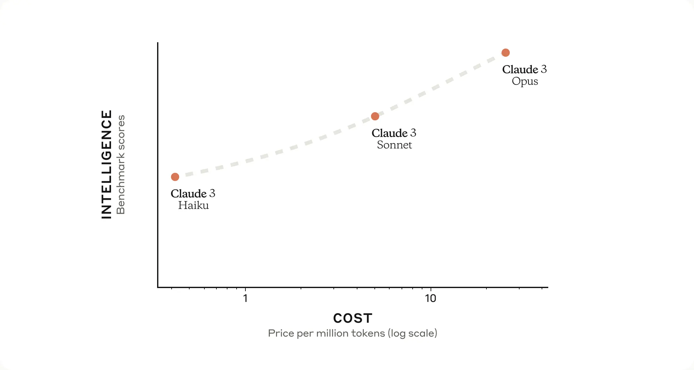
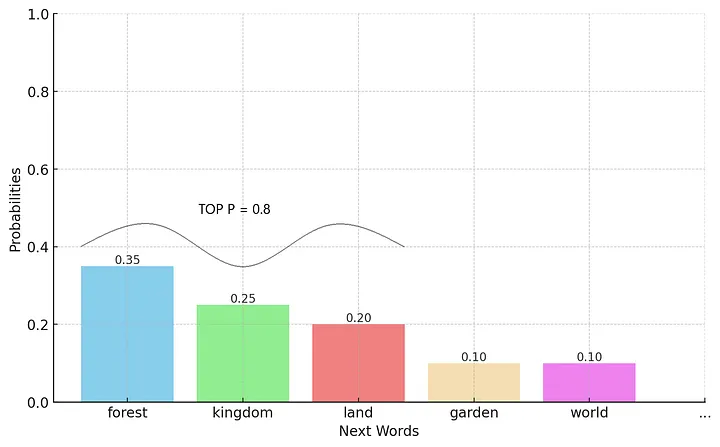
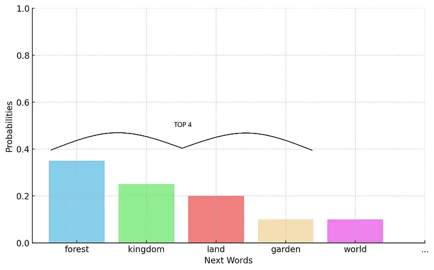
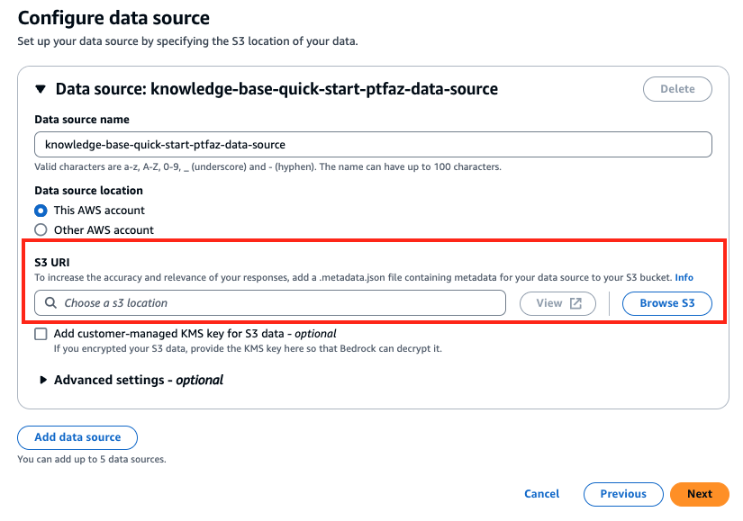
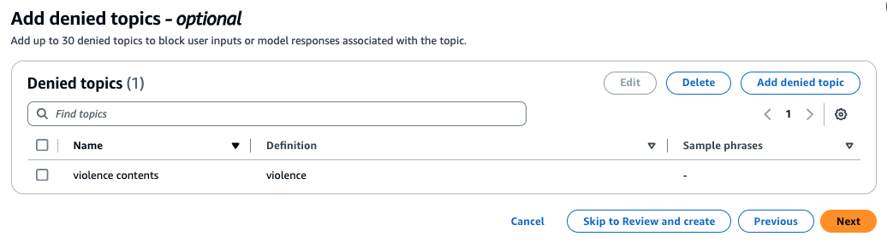
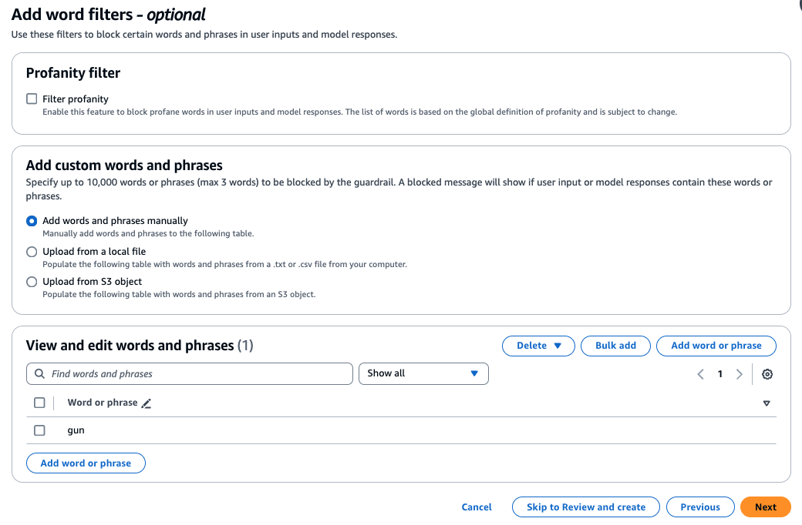
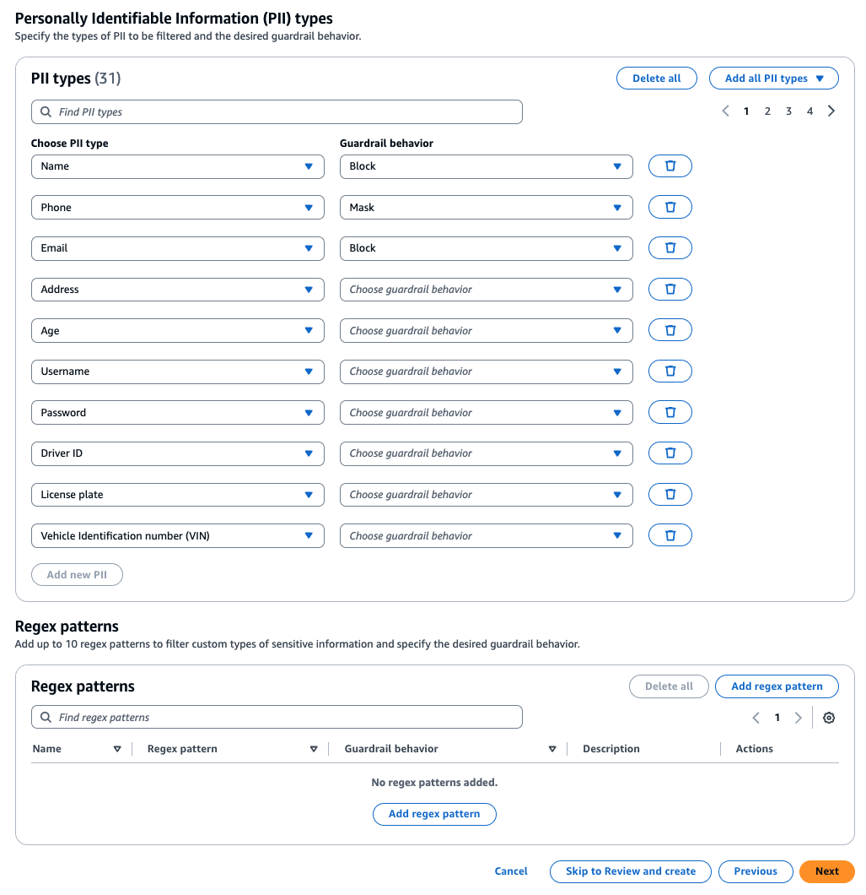

# Workshop wrap-up

## LLM Application 개발

- AWS 의 python SDK 인 boto3 를 이용하여 Bedrock API 를 호출할 수도 있고 LLM workflow framework 인 LangChain 을 이용하여 작업을 쉽게 결합할 수도 있습니다.
- Streamlit 을 사용하면 python 기반으로 LLM app 을 빠르게 개발하고 시연할 수 있습니다.
- LLM 은 기본적으로 상태를 유지하지 않습니다. 때문에 채팅과 같은 프로그램에서 앞의 채팅내역과 현재 채팅간의 맥락을 이어주려면 애플리케이션에서 상태유지를 위한 구현이 필요합니다. 오늘 실습에서는 LangChain 의 ConversationBufferWindowMemory ****클래스를 사용했습니다.

## FM 선택 및 사용자화

- 한국어 생성을 잘 지원하는 Text 모델은 Anthropic 의 **Claude** 모델입니다.
- RAG 를 위해 vector 변환에 사용되는 모델을 embedding model 이라고 하며 대표적으로 Amazon Titan Embedding G1,  Amazon Titan Multimodal Embeddings G1 모델이 있습니다.
- 한국어 Embedding 을 잘 지원하는 모델은 Anthropic 의 **Claude** 모델과 Amazon **Titan Embedding** 모델입니다.
- 이미지 생성을 잘 지원하는 모델은 Amazon **Titan Image Generator** 와 Stability AI 의 **Stable Diffusion** 모델입니다.
- 모델의 크기에 따라 비용과 성능이 달라집니다. 일반적으로 가벼운 모델은 속도가 빠르고 비용이 저렴하지만 성능 (답변품질) 은 떨어집니다.  Claude 3 모델을 예로 들면 Opus > Sonnet > Haiku 순으로 모델이 무겁고 성능이 더 뛰어납니다.
    
    
    
- PoC 를 진행할 때는 가벼운 모델을 통해서 성능을 확인하고 점차 무거운 모델로 옮겨가는 것이 좋습니다. 가벼운 모델에서도 충분히 원하는 성능을 얻을수 있기 때문입니다.
- Bedrock 에서 호출 할 수 있는 모델의 ID 는 아래 링크에서 확인할 수 있습니다.
    - [https://docs.aws.amazon.com/bedrock/latest/userguide/model-ids.html](https://docs.aws.amazon.com/bedrock/latest/userguide/model-ids.html)
- Bedrock 에서 prompt engineering 또는 RAG 로 응답을 사용자화 하는 것으로 충분하지 않은 경우는 model customizing 을 사용할 수 있습니다. 이 때 model customizing 방법은 continued pretraining 과 fine tuning 이 있습니다. continued pretraining 은 레이블이 없는 데이터 셋을 이용하여 재훈련하는 것이며, fine tuning 은 레이블이 있는 데이터를 이용하여 모델을 튜닝하는 것입니다.
- Bedrock 을 이용하여 fine tuning 과 continued pretraining 을 지원하는 모델은 아래와 같습니다. (2024.05.29 현재)
    
    
    | Model name | Model ID | Fine-tuning | Continued pre-training |
    | --- | --- | --- | --- |
    | Amazon Titan Text G1 - Express | amazon.titan-text-express-v1 | Yes | Yes |
    | Amazon Titan Text G1 - Lite | amazon.titan-text-lite-v1 | Yes | Yes |
    | Amazon Titan Text Premier | amazon.titan-text-premier-v1:0:32k | Yes (in preview ) | No |
    | Amazon Titan Image Generator G1 | amazon.titan-image-generator-v1 | Yes | No |
    | Amazon Titan Multimodal Embeddings G1 G1 | amazon.titan-embed-image-v1 | Yes | No |
    | Cohere Command | cohere.command-text-v14 | Yes | No |
    | Cohere Command Light | cohere.command-light-text-v14 | Yes | No |
    | Meta Llama 2 13B | meta.llama2-13b-chat-v1 | Yes | No |
    | Meta Llama 2 70B | meta.llama2-70b-chat-v1 | Yes | No |

## LLM Inference Parameter

- 모든 LLM 모델이 같은 inference parameter 를 갖지는 않지만 일반적으로 공통적으로 적용할 수 있는 parameter 가 있습니다.
- Sample code
    
    ```python
    body = json.dumps(
                {
                    "prompt": f"{prompt1}",
                    **"max_tokens_to_sample": 300,
                    "temperature": 1,
                    "top_k": 250,
                    "top_p": 0.99,**
                    "stop_sequences": [
                    "\n\nHuman:"
                    ],
                    "anthropic_version": "bedrock-2023-05-31"
                }
            )
    modelId= "anthropic.claude-v2:1"
    contentType= "application/json"
    accept= "*/*"
      
    response = bedrock.invoke_model(body=body, modelId=modelId, accept=accept, contentType=contentType)
    ```
    
- Top P : 발생확률이 높은 순으로 누적 % 를 선택
    
    
    
- Top K : 발생확률이 높은 토큰을 K 개 선택
    
    
    
- Temperature : 모델의 매개변수를 조정하여 예측의 무작위성 조정하는데 사용됩니다.

## RAG

- RAG 를 사용할 때 일반적으로 Knowledge Base 를 활용합니다.
- Bedrock 의 Knowledge Base 를 활용하면 쉽게 RAG 를 구현할 수 있습니다.
    
    
    

## Safeguards

- 생성형 AI 를 사용할 때 책임감있는 AI 사용이 중요합니다.
- 폭력적,선정적,차별적 컨텐츠,비속어를 요청하거나 응답하지 않도록 제어할 수 있습니다.
- Bedrock 은 아래와 같은 기능을 활용하여 Safegurrd 를 설정할 수 있습니다.
    - Watermark detection 은 Amazon Titan Image Generator 로 생성된 이미지인지 확인하는 기능을 제공합니다.
    - Guardrails 는
        - 아래는 특정 컨텐츠에 대한 guardrail 을 설정합니다.
        
        
        
        - 아래는 특정 단어에 대한 필터를 설정합니다.
        
        
        
        - 아래는 개인정보(PII) 에 대한 정책을 정의합니다.
        
        
        

## Resources

- Bedrock Workshop : [https://catalog.workshops.aws/building-with-amazon-bedrock-langchain/ko-KR](https://catalog.workshops.aws/building-with-amazon-bedrock-langchain/ko-KR)
- Jupyer notebook 기반 Bedrock Workshop : [https://catalog.us-east-1.prod.workshops.aws/workshops/a4bdb007-5600-4368-81c5-ff5b4154f518/en-US](https://catalog.us-east-1.prod.workshops.aws/workshops/a4bdb007-5600-4368-81c5-ff5b4154f518/en-US)
- Bedrock RAG 구현 : [https://aws.amazon.com/ko/blogs/aws/knowledge-bases-now-delivers-fully-managed-rag-experience-in-amazon-bedrock/](https://aws.amazon.com/ko/blogs/aws/knowledge-bases-now-delivers-fully-managed-rag-experience-in-amazon-bedrock/)
- Bedrock samples : ‣